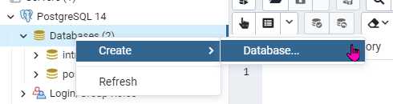
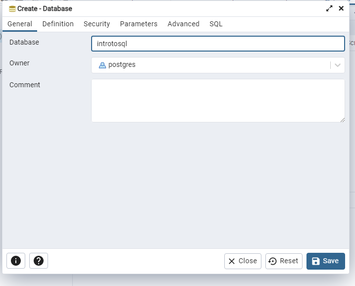

# What is a Database Anyway?

"A database is an organized collection of data stored and accessed electronically." - Wikipedia

In this case, we'll be using PostgreSQL. This is what is known as either a SQL database engine or a relational database engine. Essentially you could visualize this as a group of spreadsheets that all link together. This is in contrast to NoSQL, or sometimes NewSQL databases that have a lot of different formats, but they generally don't have the same structure to the data. We'll talk more about types of NoSQL databases later. The important thing to know for this initial discussion is that NoSQL databases refer to the structure, not the language. Almost all use some variant of the SQL language for interaction.

## Object Relational Mappers (ORM)

We won't go into ORMs, but if you do development work it's useful to know what these are.

If you've interacted with a database with a language other than SQL more than likely you were using a tool known as an Object Relational Mapper or ORM. These tools translate other languages into SQL so that the dev doesn't have to know much SQL to write their application. These tools are great for a lot of things, but are far from perfect. Understanding SQL is still useful for interacting with the database when your ORM is having an issue translating for you.

## Tables

Tables are the things we work with the most in relational databases. It's useful to visualize them just like a spreadsheet table, but how we interact with them is quite different.

To start with, it is common to have some sort of "ID" column. For now, you can think of this kind of like a row number. It creates a convenient way to identify a specific row of data.

| ID | OrderDate | Region | Rep | Item |
| --- | --- | ---| --- | --- |
| 1 | 1/6/2020 | East | Jones | Pencil |
| 2 | 1/23/2020 | Central | Kivell | Binder |
| 3 | 2/9/2020 | Central | Jardine | Pencil |
| 4 | 2/26/2020 | Central | Gill | Pen |
| 5 | 3/15/2020 | West | Sorvino | Pencil |

## Setup the First Table

In order to start learning the code, we are going to do a bit of setup. Don't worry- we'll explain what all this stuff means soon.

In PGAdmin it will probably ask you to create a master password the first time you open it. Create a password you'll remember and open up the tool. There's a lot of stuff here, but we'll only be using a couple things.

Rather than scripting the new database, we'll do that part from the UI. Right click on 'Databases' in the left-hand tree and select Create > Database.



Again, there are a whole bunch of options here, but all we need to do is give it a name. Enter `introtosql` into the Database field and go ahead and save.



This should add the database to that left listing and show a bunch of options here. The refrain here is "don't worry about most of it."

Right click the database to open up that menu. If you want to delete everything and start again, use the `Delete/Drop` option. What we want is the `Query Tool` near the bottom of the list.


This is where we'll write our actual code. The script below will create our first table. I'll explain what it all means soon enough, but for now it's copy/paste time.

```SQL
CREATE TABLE IF NOT EXISTS public.first_table
(
    "id" SERIAL PRIMARY KEY,
    "order_date" date NOT NULL,
    "region" character varying,
    "rep" character varying NOT NULL,
    "item" character varying NOT NULL
);
```

You should get a success message at the bottom. If so, copy/paste one more time to add some data to the table.

```SQL
INSERT INTO public.first_table(
 order_date, region, rep, item)
 VALUES ('01/06/2020','East','Jones','Pencil'),
  ('01/23/2020','Central','Kivell','Binder'),
  ('02/09/2020','Central','Jardine','Pencil'),
  ('02/26/2020','Central','Gill','Pen'),
  ('03/15/2020','West','Sorvino','Pencil');
```
