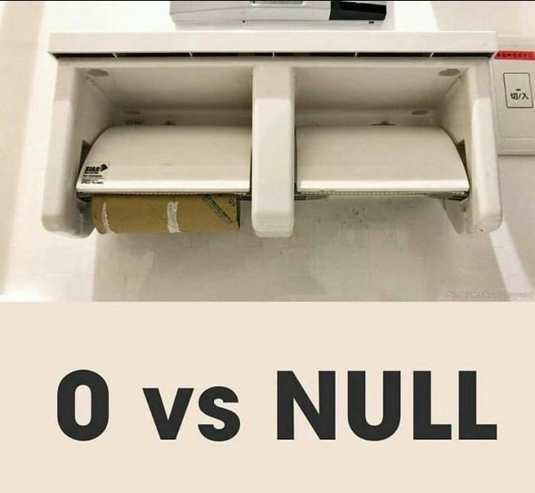

# Writing Your First Queries

Now that we've loaded the data we can start interacting with it. There are four main operations we do when working with data (this applies to coding as well). They are `create`, `read`, `update`, and `delete`, which is often shortened to CRUD.

We can also translate this to specific commands in SQL. The `INSERT` command we've already tried out when setting up the database.

*Note: It is standard practice to write SQL keywords in all caps, but most database engines don't care- it's just to help readibility.*

| CRUD | SQL |
| --- | --- |
| Create | `INSERT` |
| Read | `SELECT` |
| Update | `UPDATE` |
| Delete | `DELETE` |

There are a couple more useful definitions before we get started.

- A 'keyword' is a special word that tells SQL what we are about to do or covers a special case.
- A 'statement' is a chunk of SQL code we can run on it's own or with other code. You can think of this like a sentance. It has a bunch of stuff in it that is a complete thought.
- A 'clause' is one piece of a statement. Usually it contains one or two SQL keywords plus related info.

## SELECT

The most common command we use is to read data, or the `SELECT` statement. A basic select statement consists of the `SELECT` keyword, a list of column names with commas between them, the `FROM` keyword, and finally the table name.

```SQL
SELECT id,
    order_date,
    region,
    rep,
    item
FROM first_table
```

There are a couple more things we can do here. First off, there is a shorter way to return all columns. When writing for an application you it's bad practice to use this, but when you are just looking at the data directly it can save a lot of time. To return all columns, replace the column list with an astrisk (`*`)

```SQL
SELECT *
FROM first_table
```

### WHERE

The next step is to only get a part of the data instead of the whole table. To filter the data, we add a `WHERE` clause after the table name. There a lot of options here, but the basic comparison operators (things like =, >, <, etc.) are all available.

This allows us to only get rows from the 'East' region. Note that in Postgres we do need to match the text's case. Not all DB engines do this.

```SQL
SELECT *
FROM first_table
WHERE region = 'East'
```

Or we might want all the orders made on or after February 1st.

```SQL
SELECT *
FROM first_table
WHERE order_date >= '2/1/2020';
```

## INSERT

Next thing we'll go over is insert statements. There are two main ways that we can do this. We've already used one, which is to write out the values we are adding. The second is from a `SELECT` statement.

When we insert data we start with `INSERT INTO <table>` and a list of columns in parenthesis `(order_date, rep, item)` (I'm leaving out region on purpose- we need something to update later!). When adding static values, we use the `VALUES` keyword and then the data we want to add. Each line is enclosed in parenthesis, with commas between them.

```SQL
INSERT INTO first_table(order_date, rep, item)
VALUES ('4/18/2020','Jones','Pencil'),
    ('04/05/2020','Kivell','Pen');
```

When combining `INSERT` and `SELECT` the `SELECT` statement replaces the `VALUES` piece. It looks just like the ones we've already created, but the column names and types need to match. We can also mix static values in, but they would be the same for every row we enter.

### OR and AND

We'll also add something new to our `WHERE` clause. In order to check on multiple conditions we can use `AND` and `OR` to combine different filters.

```SQL
INSERT INTO first_table(order_date, region, rep, item)
SELECT order_date,
    'East',
    rep,
    item
FROM first_table
WHERE order_date = '4/18/2020'
    AND rep = 'Jones';
```

## UPDATE

### NULL Values

Before we start on our `UPDATE` script, let's talk about what happened when we left out the region column on our first insert. If you were looking at the script I used to create our first table, you may have noticed some columns listed `NOT NULL` and the region column said `NULL` in the definition. This determines whether or not we can have null values in that column. Try leaving out the rep column in an insert - the insert will fail because we have to have a value in that column.

`NULL` is one of those things that can be confusing to new coders. Basically we have two different ways to explain when we don't have anything. We can have zero of something, say zero cookies, or we can have nothing, or no food at all. The toilet paper meme is the best way I've seen at describing it.



When looking for null values in our `WHERE` clause the comparison is a little different. We use `IS NULL` and `IS NOT NULL` to check for this special type of data. We can look for data missing region info this way.

```SQL
