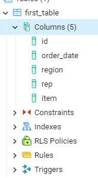

# Table Commands

There are three main things we can do from the table level- Create, Alter, and Delete. We can also do the 'read' part of the CRUD acronymn and read the table's metadata, but usually we'll just do that from the UI.

Essentially, this is how we usually do a 'read' operation on a table:



## Create

We've already created one table, but let's create a second. One of the principles of SQL database design is to avoid repesting data when possible, especially when there are only a few values. The rep data repeats a lot, so let's move that into a seperate table.

```SQL
CREATE TABLE second_table
(
    "id" SERIAL PRIMARY KEY,
    "rep" character varying NOT NULL DEFAULT 'Fluffy'
);
```

`CREATE TABLE` is of course the keywords for creating a table followed by the table name. We use parenthesis to enclose the list of columns and configuration information in the table.

Each column is named, followed by the type of data. There are [plenty of types](https://www.postgresql.org/docs/current/datatype.html) available, and this varies a bit by engine. `character varying` basically means text without a set length. `SERIAL` is a special type- it's the auto-increment integer key we talked about earlier. We do also need to specify that column as the primary key.

We've already talked about `NULL` vs. `NOT NULL` and that gets specified when we create the table. There's one new thing here - `DEFAULT`. Default values are what is added if you don't specify a value on insert. It lets us sidestep the 'NULL vs. zero' problem.

To populate the data from the first table into the second, we'll do an insert by a select. the `DISTINCT` keyword let's us get just one copy of each value.

```SQL INSERT INTO second_table (rep)
SELECT DISTINCT rep 
FROM first_table
```

## Alter

When working with database structures we use `ALTER` instead of `UPDATE`. Let's add a new foreign key that which points to our new table. For now we need to allow the column to allow nulls- we'll add the data later. In the real world we might alter the table again after updating the data to disallow nulls since every sales should have a rep.

```SQL
ALTER TABLE first_table
    ADD COLUMN rep_id INTEGER NULL,
    ADD CONSTRAINT fk_first_second_rep FOREIGN KEY (rep_id) REFERENCES second_table (id);
```

`ALTER` table looks a lot like `CREATE`, but instead of including columns, we have a list of changes we want to make to the table. `ADD COLUMN` looks just like adding it in the first place. However, we have a new concept here, called a constraint. Constraints include a lot of different types of specicial rules on a column, and that includes keys. The constraint/key gets a name, a type, and we tell SQL which two columns to link.

Now we can update the first table to add our new rep IDs. There's a new little quirk- each table name has a letter after it. We use this to specify which table we are talking about later in the query, which will be extremely important when we get to pulling data from multiple tables. You can use the full table name, but convention is to use a shortened version, often just one or two letters, related to the full table name, to make the query easier to read.

```SQL
UPDATE first_table f SET
    rep_id = s.id
FROM second_table s
WHERE f.rep = s.rep;
```

## DROP

Now that our data is added, we can get rid of the old column. The equivilent of delete when working with these structures is `DROP`. It is used for deleting tables, columns, constraints, and even full databases.

```SQL
ALTER TABLE first_table
    DROP COLUMN rep;
```
