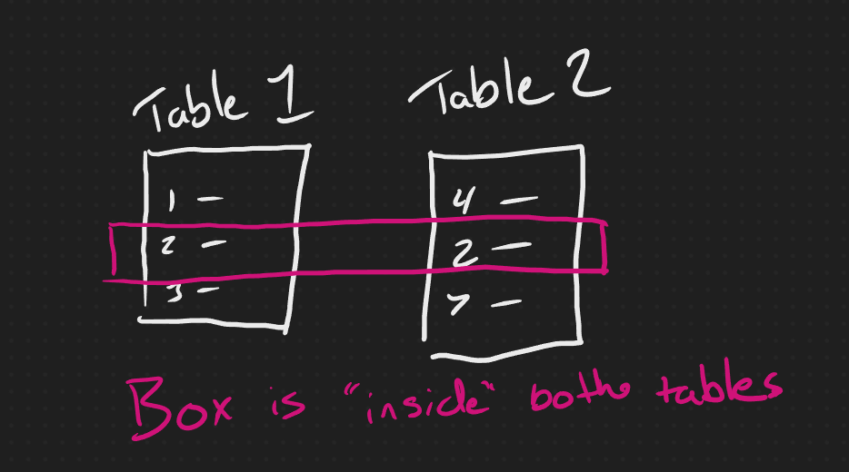
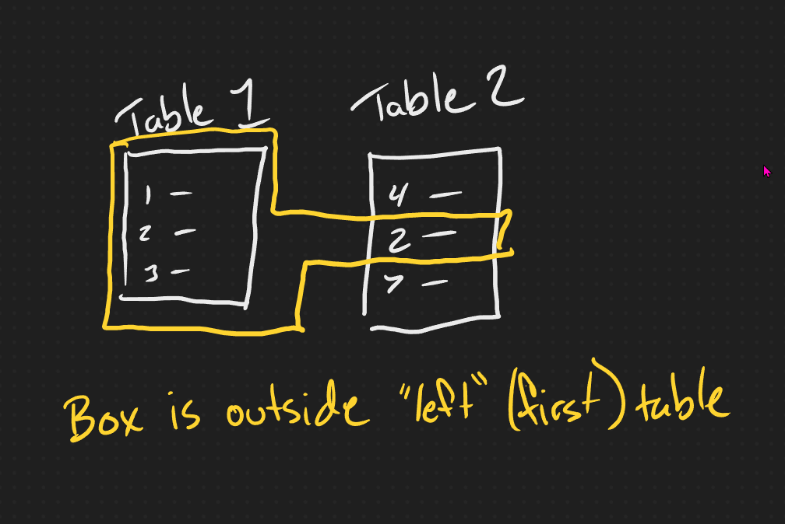
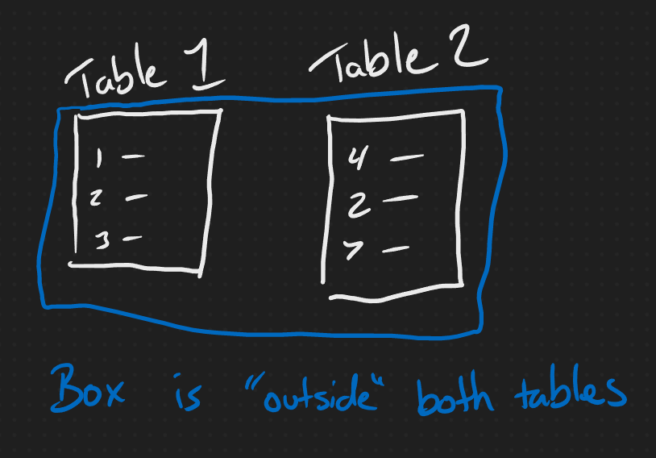

# Data Joins

There are three four types of joins: inner, outer, left, and right. It's worth noting that right joins are almost never used- they have the same result as left joins, we just swap the order of the tables.

```SQL
SELECT 
    f.id,
    f.item,
    s.rep
FROM first_table f 
INNER JOIN second_table s
    ON f.rep_id = s.id;
```

The `SELECT` part starts out the same as normal, though we usually add an alias to the table name. Next we mark the join type and the table name. Finally we set the join condition. This is basically a `WHERE` clause that specifies how to match data from one table to another. If we add more tables, we can join as many tables as we want together, and we can even join tables to themselves. A common use might be and employee table where we want to list employees and their bosses.

Understanding join types often trips people up, and there are a few different ways of explaining them, but I'll use my favorite - boxes.

## INNER JOIN

Inner join only returns the data that matches the join condition from both tables. If we were to draw a box around the returned data, it would be inside both tables.



## LEFT/RIGHT (OUTER) JOIN

Left and right joins return all the data from one table, but only matching rows from the second. We use this a lot for pulling in optional data. Maybe we add a website to our business where customers can order without talking to a rep. In that case not every row in the first table would have associated rep data. In order to pull all the sales and any related reps we'd use a left join. In this type, the box is inside one table and outside the other. You can keep the two seperate by removing the line break in the query `FROM first_table f INNER JOIN second_table s`. This first table listed is on the left, second table is on the right. With boxes, the box goes outside the left (first table) and inside the second.



## FULL OUTER JOIN

We almost always use `INNER` and `LEFT` join, but we can also use an `OUTER` join. This returns all data from both tables even if there are no matches. For rows with no match, we get every possible combintation of rows. Postgres, and many other engines, don't match null values to other nulls, so this can increase the number of rows returned dramatically.

Exxample:

First table ids: [1, 2, 3]

Second table ids: [1, 4, 5]

Resulting rows:

| First | Second |
| --- | --- |
| 1 | 1 |
| 2 | 4 |
| 2 | 5 |
| 3 | 4 |
| 3 | 5 |


