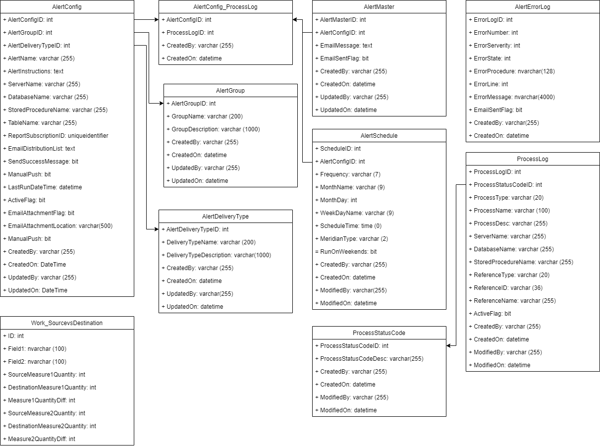

# Database Diagrams

When talking about database design, it's helpful to understand how we document databases. Usually use boxes with the table names, and might include column names and types. Arrows indicate connections between different tables.

