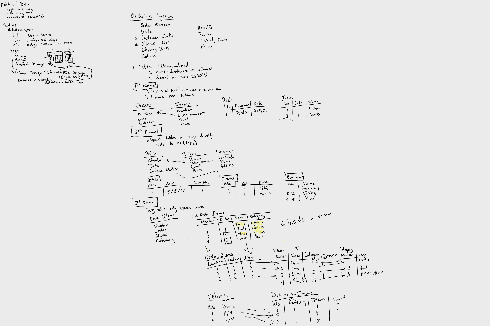
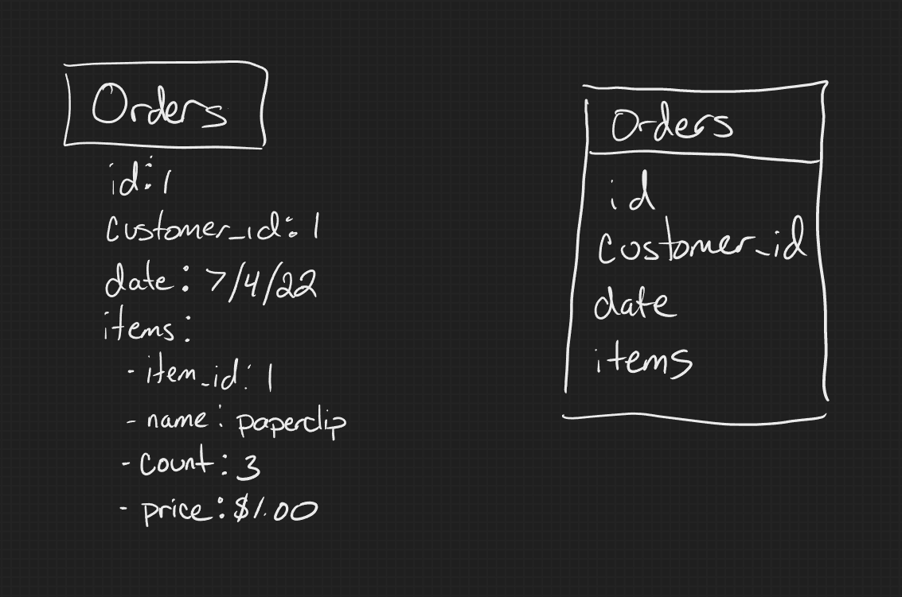
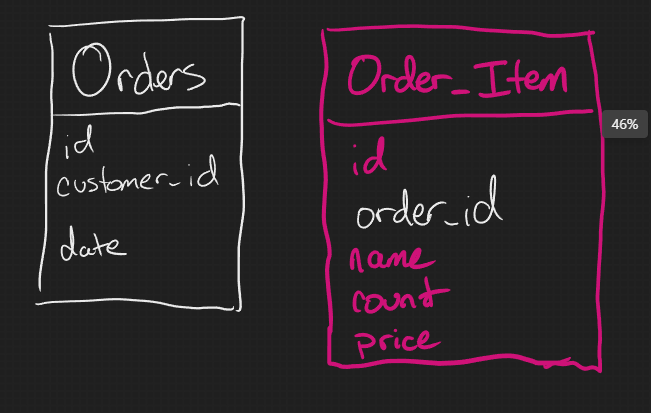
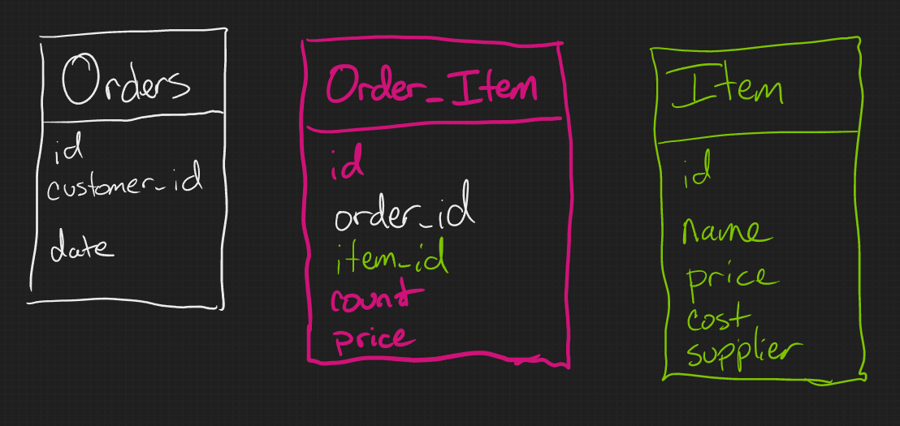
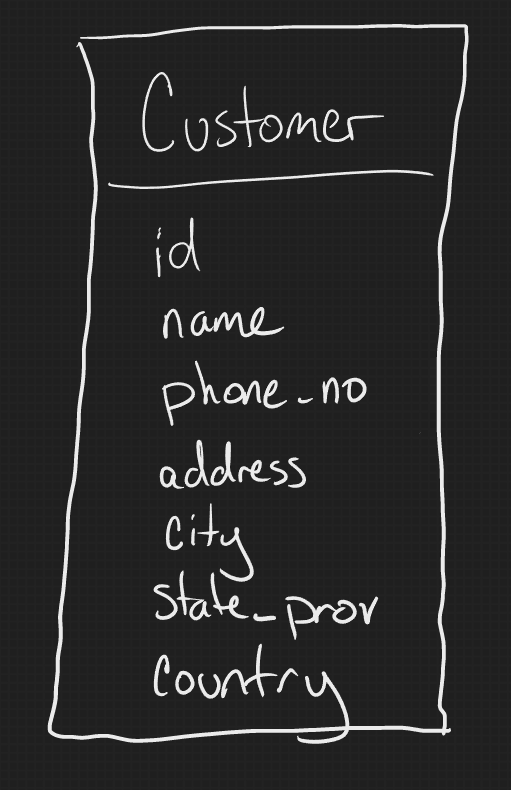
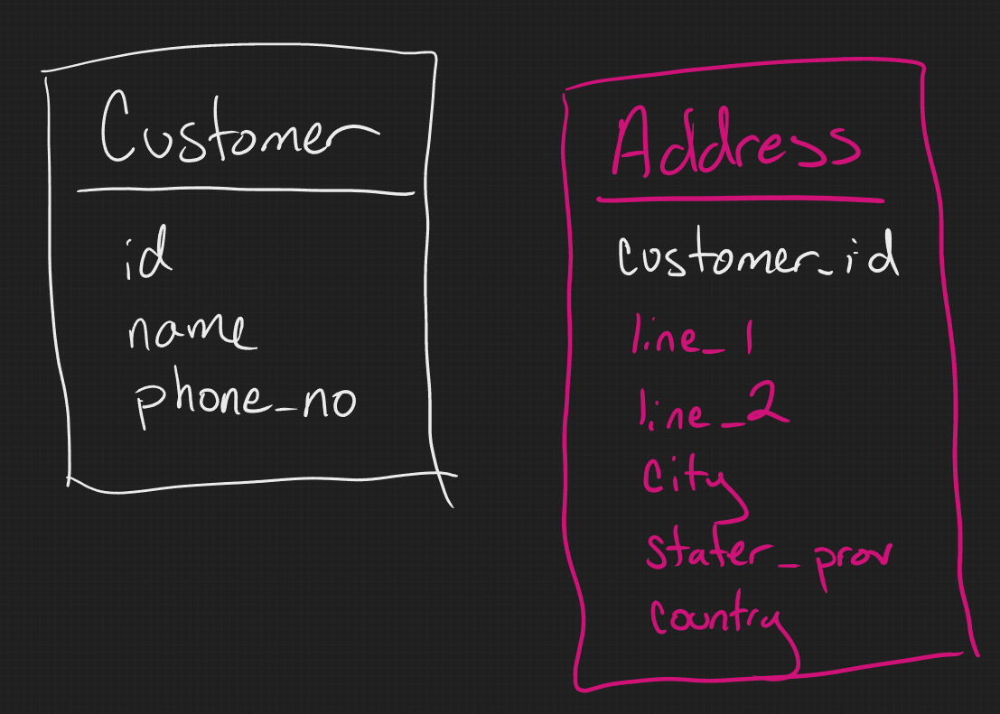
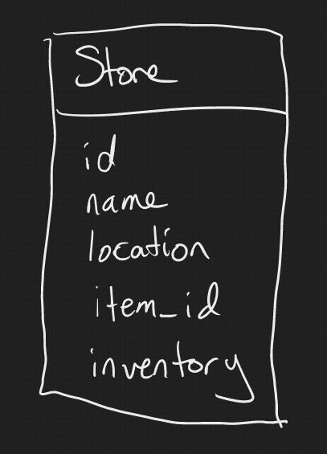
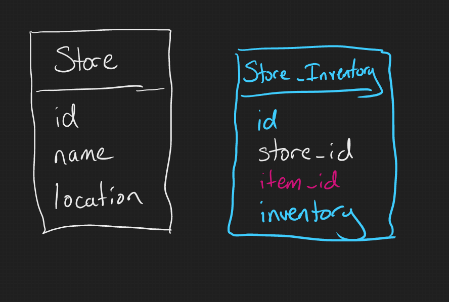
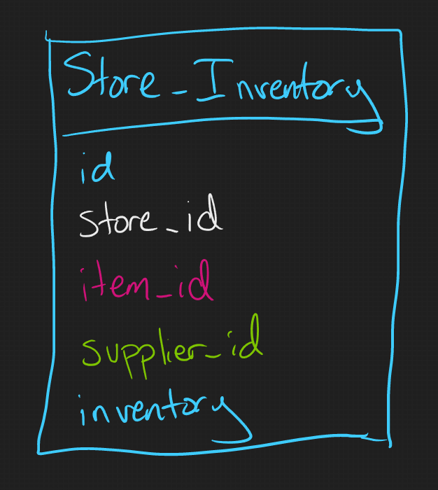

# Relational Database Design

Database design patterns are determined by how we use the data and by how it is physically stored on disk. We've been using PostgreSQL which is a relational database with tables.

Other systems include:

- Column Store DBs
- Document DBs
- Graph DBs

## Example: Sales Order System

What kinds of things go into that?

- Customers
- Items
- Sales
- Locations
- Dates
- Shipping info
- Returns

## Data Relationships

- 1-1 (one to one): A single item that is sold will generally only have one return (or zero)
- 1-m (one to many): A customer can have multiple orders, but an order usually only has one customer
- m-m (many to many): A sale can have multiple item types and an item type is sold multiple times.

## Primary Key

In a table we usually set a primary key that is either an integer or a UUID. In database normalization, we refer to a primary key that is a row that uniquely identifies a row. So an American has a social security number that uniquely identifies them in a lot of places. A book has an ISBN number. We sometimes use compound keys. We might decide that someone's name + phone number is enough to uniquely identify them.

## Database Normalization

The theory behind relational database design is called DB normilization, and each "step" is a normal form. It's worth noting that we almost never use these terms formally in the real world, and simply discuss the cost vs. benefit of implementing a a piece of a design. I've also been seeing a more hybrid approach between relational and document DBs, where normalization is completely ignored in some cases in favor of storing some data in JSON blobs.

For each of these forms, I'll try to point out places in our sales order DB where we might follow that rule and where we might ignore it. I'm also going to stop at 5th normal. Acedemics have proposed rules past that, but they are rarely practical in real life.

### Why We Care

- To free the collection of relations from undesirable insertion, update and deletion dependencies.
- To reduce the need for restructuring the collection of relations, as new types of data are introduced, and thus increase the life span of application programs.
- To make the relational model more informative to users.
- To make the collection of relations neutral to the query statistics, where these statistics are liable to change as time goes by.

— E.F. Codd, "Further Normalisation of the Data Base Relational Model"

### 1st Normal Form

*Definition: Each column contains one value.*

For this rule, let's take a look at our order table. In a document DB, All the items in an order would probably be stored in the same "table" (document).

This preforms well for reads, and that is an advantage of document DBs, but it does have some issues.

1. Updates are expensive and difficult. If we wanted to update an order, we need to update all the item data, we can't just update that one item, we have to read and write all the item data in that order.
2. It's hard to verify that all the required data is there. Relational databases usually allow us to mark a column as `NOT NULL` to force us to put data in that column (and we can put more restrictions if needed.). When we throw a JSON blob in the column instead, we loose the ability to control what goes into it.

In 1st normal we'll take those items and split them out into seperate tables in a 1-m relationship.

**Counter Example**

When I first started, I rarely saw databases that weren't fully in 1st normal form. More recently I rarely see one that is. Most commonly I see this with supplimenary data that doesn't fully justify a whole other table.

//TODO: actual example?

### 2nd Normal Form

*Definition: Separate tables for things that appear in multiple rows.*

What if we wanted to rename an item across all orders? That would be a huge pain if we only include the name in the order_item table, then updating the data would require updating every single row with that item. We've probably already got an Item table in order to display the data on the website, so lets include a reference to that table instead. Even though the Item table has a price, I'm going to keep the one in the Order_Item table. Prices often change over time, and we want the Order_Item table to reflect the price at the time the order was made, and the Item table will have the current price.

**Counter Example**

Things like dates and numbers often appear multiple times in a column, but we almost never seperate them out into other tables. We very rarely want to change all the values for something like a given date, and there's a cost to seperating them into another table. Interestingly, analytics DBs often do have a date table. Because so much reporting involves comparing data by date accross tables, seperating the dates out has enough value to warrant it.

### 3rd normal

*Definition: Separate tables for things not related to the primary key*

For this one, let's shift over to our customer table. It's pretty common to see things like addresses and phone numbers in the customer table along with the rest of their info.

Address data isn't really dependant on the customer info. I could also have addresses for things like physical stores, suppliers, and employees. A customer might also have more than one shipping address they'd like to have saved. So instead we create a seperate addresses table to hold this info.

**Counter Example**

I didn't seperate out phone number even though it has the same situation as addresses. You might do this if you want a customer to have multiple phone numbers, though there are other ways to handle that, but other than that you'd usually have a table with just an id and one column. Here again, the performance cost just isn't worth it in most cases.

### 4th normal

*Definition: Separate tables based on dependencies.*

If our business has physical stores, we probably want to know their location, and their stock of each item. One way to do this is to store this in a single table.

However, the inventory doesn't really have much to do with the store data, so in 4th normal we make sure to seperate this out.

### 5th normal

*Definition: Every dependant column is dependant on all key columns.*

This one is kinda weird, but let's look at our store and item tables. We are then going to add in the concept of suppliers. Stores often sell the same product made by different suppliers, but not every supplier of a product may be sold at a given store. To model this relationship, we may end up with a table with three columns in our store inventory.

If it is harder to bring a new supplier into a store, or if we want to keep track of items that a supplier offers not currently sold in any stores, this can be a problem. So instead we break that into 3 seperate tables.

**Counter Example**

A pretty common pattern that wouldn't use this scenario is if there is a 1-m relationship between our Item table an Suppliers. We might then use an Item_Category table to group those items together.

## Other Considerations

Query plans/indexing
Clustered indexes
Non-clustered (btree)
Hash
Full text

Partitioning horizontal vs vertical

Acid - atomicity consistency. Isolation, durability

Referential integrity

Star schemas
